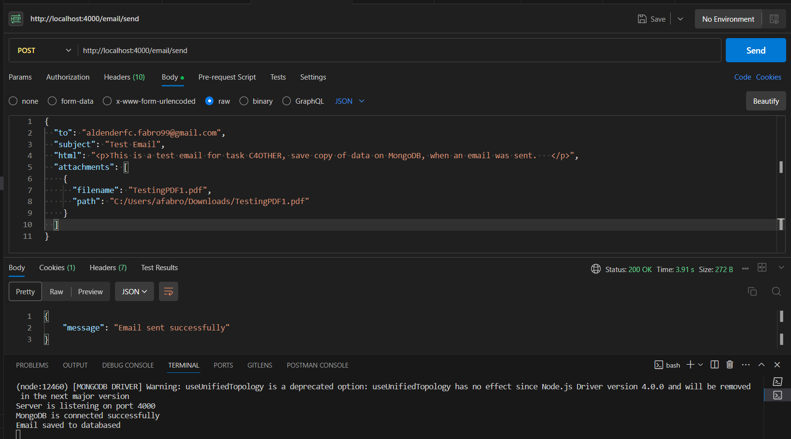

# Node.js Email Sending API

This Node.js application provides an API endpoint to send emails using Nodemailer and Google OAuth2, also saving them to the database (MongoDB) upon successful sending..

## Features

- **Email Composition:** Easily compose emails with desired recipients, subjects, and HTML content.
- **Attachment Support:** Send emails with attachments in various formats.
- **Flexible Configuration:** Customize the email content and recipients based on your requirements.
- **Saving to database:**  Details of the email will be saved in a database.

## Prerequisites

- Node.js installed
- Gmail account
- Google OAuth2 credentials
- Postman or any API testing tool
- Mongoose fot the database

## Getting Started

1. Clone this repository.
2. Install dependencies using `npm install`.
3. Set up environment variables:
   - Create a `.env` file based on `.env.example`.
   - Add necessary environment variables like `PORT`, `CLIENT_ID`, `CLIENT_SECRET`, `REFRESH_TOKEN`, `MY_EMAIL`, `MONGO_URL`.
4. Start the server using `nodemon index.js`.

## API Endpoints

### Send Email

- **Endpoint:** `POST /email/send`
- **Request Payload:**

#### Sending emails without attachments:
```json
{
  "to": "recipient@example.com",
  "subject": "Test Email",
  "html": "<p>This is a test email !</p>"
}
```

### Sending emails with attachment:
```json
{
  "to": "recipient@example.com",
  "subject": "Test Email with Attachment",
  "html": "<p>Hello, this email contains an attachment.</p>",
  "attachment": {
    "filename": "sample.pdf",
    "path": "/path/to/your/sample.pdf"
  }
}
```

# Sending emails with multiple attachments
```json
{
  "to": "recipient@example.com",
  "subject": "Test Email with Multiple Attachments",
  "html": "<p>Hello, this email contains attachments.</p>",
  "attachments": [
    {
      "filename": "sample1.pdf",
      "path": "/path/to/your/sample1.pdf"
    },
    {
      "filename": "sample2.docx",
      "path": "/path/to/your/sample2.docx"
    }
  ]
}
```
The JSON structure for sending emails with attachments using Nodemailer typically includes the following fields:

- `"to"`: The recipient's email address.
- `"subject"`: The subject line of the email.
- `"html"`: The HTML content of the email body.
- `"attachment"`: Details about the attachment.
  - `"filename"`: The name of the attached file.
  - `"path"`: The file path where the attachment is located in your server's file system.

### A successful email sent 

